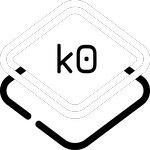

# k0 - Keyboard Overlay for keymap-drawer

This is still a very early proof of concept approach, for now it only supports static images.
Going forward it will change the layout depending on key presses.

## Install & Usage

Get tauri-cli v2 and go ham!

[preview.webm](https://github.com/user-attachments/assets/19f71773-af21-4d52-9328-ae64dc4c1f35)
