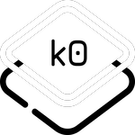

<div align="center">



# k0

**Live keyboard overlay for Linux, macOS & Windows**

A KeyCastr-inspired overlay that reads raw key events, highlights pressed keys on your keymap-drawer SVG, and switches layers in real-time — firmware-agnostic (QMK · ZMK · VIAL · anything).

[preview.webm](https://github.com/user-attachments/assets/f393e3d7-74d6-4cae-bf1d-44cd5dfb4945)

[](https://github.com/seppulcro/k0/releases)
[](https://github.com/seppulcro/k0/actions/workflows/ci.yml)
[](https://scorecard.dev/viewer/?uri=github.com/seppulcro/k0)
[](https://github.com/seppulcro/k0/issues?q=is%3Aissue+label%3Arenovate)
[](https://www.coderabbit.ai)
[](./LICENSE)

</div>

---

## Features

- 🎹 **Real-time key highlights** — SVG keys light up on press via CSS class toggles, no DOM rebuilds
- 🗂️ **Automatic layer switching** — hold-tap detection with configurable tapping term
- 🎨 **8 themes** — Catppuccin × 4, Tokyo Night, Dracula, Nord, Gruvbox — live-applied
- ✨ **4 animations** — Snappy, Smooth, Bouncy, Instant
- 🔌 **Bring your own keymap** — drag & drop a [keymap-drawer](https://github.com/caksoylar/keymap-drawer) YAML + SVG, or a ZIP — hot-swap at runtime
- 🪟 **Tiling WM friendly** — no hardcoded heights, fully resizable, transparent overlay window
- 🧪 **Browser mock mode** — full UI runs at `?mock` without Tauri for Playwright / agent testing

---

## Getting started

### Prerequisites

Toolchain versions are pinned in [`.tool-versions`](./.tool-versions) and
[`package.json`](./package.json) so local dev matches CI bit-for-bit.

Install via a polyglot version manager that reads `.tool-versions` —
[mise](https://mise.jdx.dev), [asdf](https://asdf-vm.com), or
[vfox](https://vfox.dev) — then enable Corepack for pnpm:

```bash
mise install     # or asdf install / vfox install
corepack enable  # picks pnpm version from package.json
```

**Linux only:** user must be in the `input` group:

```bash
sudo usermod -aG input $USER  # then log out/in
```

### Install & run

```bash
pnpm install   # also installs lefthook git hooks via `prepare`

# Dev — hot-reload frontend + Rust watch
pnpm tauri dev

# Production build
pnpm tauri build
```

---

## Bring your own keymap

### Option A — Drag & drop (recommended)

Open **⚙ → Import/Export** and drop your files onto the import zone:

| Drop target | What happens |
|---|---|
| `.yaml` | Replaces the keymap config (re-parses layers, labels, hold bindings) |
| `.svg` | Replaces the keyboard SVG layout |
| `.zip` | Extracts and applies both (expects exactly one `.yaml` + one `.svg`) |

You can also drop a `.yaml` and `.svg` together in one gesture. Imports are validated before applying and persisted across reloads. Use **↺ Reset** to revert to the bundled defaults, or **⬇ Download .zip** to export your current config.

### Option B — Replace bundled assets

Replace `assets/keymap.yaml` and `assets/keymap.svg` with output from [keymap-drawer](https://github.com/caksoylar/keymap-drawer):

```bash
keymap parse -z your_keymap.zmk.c > assets/keymap.yaml
keymap draw assets/keymap.yaml > assets/keymap.svg
```

k0 reads the YAML to derive:

| Field | Purpose |
|---|---|
| `t:` (tap label) | physical key → position mapping |
| `h:` (hold value matching a layer name) | marks key as a layer activator |

No manual config file needed — the YAML is the single source of truth.

---

## Settings

Open the **⚙** button (top-right of the overlay):

| Tab | What it does |
|---|---|
| **Devices** | Select `/dev/input/eventN` nodes. Devices sharing a `uniq` ID are grouped. Selection persisted. |
| **Theme** | 8 themes applied live via CSS custom properties. |
| **Input** | Hold–tap threshold slider (100–500 ms, default 200 ms). Persisted in `localStorage`. |
| **Import/Export** | Drag & drop `.yaml`, `.svg`, or `.zip` to hot-swap your keymap. Export current config. Reset to defaults. |
| **Console** | Live log stream from the Rust backend. |

---

## Mock mode & Playwright MCP

The full UI runs in any browser without Tauri — open:

```
http://localhost:5173?mock
```

`window.__k0mock` is exposed for scripted interaction:

```js
await __k0mock.typeSequence(['a','s','d','f'], 100)   // press keys
await __k0mock.holdLayer('nav')                        // activate a layer
await __k0mock.layerTour()                             // tour all layers
await __k0mock.demo()                                  // full key demo
```

**Playwright MCP** (`.vscode/mcp.json`) lets GitHub Copilot's browser tool interact with the overlay directly for agentic testing and recording.

```bash
pnpm test           # run Playwright smoke tests (headless)
pnpm test:ui        # open Playwright UI
pnpm record-demo    # re-record assets/preview.webm
```

---

## Code quality

```bash
pnpm biome check src/          # lint + format check
pnpm biome check --write src/  # auto-fix
cd src-tauri && cargo check    # Rust type check
pnpm run build                 # full Vite build
```

> **Rule:** fix the error, don't suppress the rule.

**VS Code:** install the [Biome extension](https://marketplace.visualstudio.com/items?itemName=biomejs.biome) — format-on-save and organise-imports-on-save are pre-configured.

### Agentic dev loop

```
edit → biome fix → build check → cargo check → tauri dev
```

When using an AI agent, always validate with `pnpm biome check src/` + `pnpm run build` + `cargo check` before shipping.

---

## CI / supply chain

Every PR runs [`ci.yml`](.github/workflows/ci.yml) — anything that turns red
blocks the merge. The same chain you run locally:

| Job | Tool | Purpose |
|---|---|---|
| `ubuntu-22.04` / `macos-latest` / `windows-latest` | `pnpm biome check` + `pnpm run build` + `cargo check` | Per-OS frontend lint, Vite build, Rust type check |
| Lint workflows | [actionlint](https://github.com/rhysd/actionlint) | Validates `.github/workflows/*.yml` |
| Secret scan | [gitleaks](https://github.com/gitleaks/gitleaks) | Pattern-based detection of committed secrets |
| Secret scan (verified) | [TruffleHog](https://trufflesecurity.com) `--only-verified` | Confirms detected secrets are live credentials |
| Dependency review | [actions/dependency-review-action](https://github.com/actions/dependency-review-action) | Blocks PRs introducing high-severity CVE deps |
| Egress audit | [StepSecurity Harden-Runner](https://github.com/step-security/harden-runner) | Logs CI egress — detection baseline for compromised actions |

Weekly: [`scorecard.yml`](.github/workflows/scorecard.yml) runs
[OpenSSF Scorecard](https://github.com/ossf/scorecard) and pushes
results to GitHub Security tab + the public badge above. GitHub-native
**CodeQL** default-setup runs SAST on every PR + push for actions,
JavaScript/TypeScript, and Rust.

### Bots

| Bot | Config | What it does |
|---|---|---|
| [CodeRabbit](https://www.coderabbit.ai) (free for public repos) | [`.coderabbit.yaml`](./.coderabbit.yaml) | AI PR review on every PR — path-aware instructions for `src/`, `src-tauri/`, `.github/` |
| [Renovate](https://docs.renovatebot.com) | [`renovate.json`](./renovate.json) | Dependency-update PRs (npm + cargo + gh-actions); weekly lockfile maintenance; pins gh-action SHAs; major updates require dashboard approval |
| [Release Please](https://github.com/googleapis/release-please) | [`release-please-config.json`](./release-please-config.json) | Auto-opens a release PR from Conventional Commits; merging it tags `vX.Y.Z` and triggers `release.yml` |

Dependabot security updates are enabled in repo settings as a fallback
for vulnerability fixes.

---

## Releases

Builds publish automatically on `v*` tags pushed to `main`.

| Platform | Runner | Artifact |
|---|---|---|
| Linux | ubuntu-22.04 | `.deb` + `.AppImage` |
| macOS arm64 | macos-latest | `.dmg` |
| macOS x86_64 | macos-15-intel | `.dmg` |
| Windows | windows-latest | `.msi` + `.exe` |

---

## Contributing

See [CONTRIBUTING.md](./CONTRIBUTING.md) for toolchain setup, branch
naming, release flow, SemVer policy, and PR review (CodeRabbit /
Renovate). Vulnerability reports: [SECURITY.md](./SECURITY.md).

---

## Changelog

### v0.3.0
- **Import/Export tab** — drag & drop `.yaml`, `.svg`, or `.zip` to hot-swap keymap at runtime
- Reactive keymap store — imported configs persist across reloads via `localStorage`
- Export current YAML + SVG as a `.zip` archive
- Reset to bundled defaults button
- Minimal native ZIP read/write (no dependencies)
- CI: replace deprecated `macos-13` runner with `macos-15-intel`

### v0.2.2
- Browser mock mode (`?mock`) — full UI without Tauri, `window.__k0mock` simulator
- Playwright smoke tests + MCP browser config (`.vscode/mcp.json`)
- `pnpm record-demo` script — reproducible 2K demo recording
- CI: macOS x86_64 runner fixed to `macos-13` (native Intel)
- CI: explicit `rust-target` matrix key
- README overhaul

### v0.2.1
- macOS CI: arm64 + x86_64 split into separate native runners
- Gitflow enforced: version-bump-via-PR, branch naming conventions

### v0.2.0
- matcha.css integration with theme var bridging
- Settings panel: Devices, Theme, Input, Console tabs
- SVG overlay fix: `div.innerHTML` parse (Tauri WebView MIME workaround)
- Responsive flex layout, permanently resizable window
- CI/CD: Linux + macOS + Windows via `tauri-action`

### v0.1.0
- Initial release: evdev Rust backend, SVG layer switching, raw key event capture
